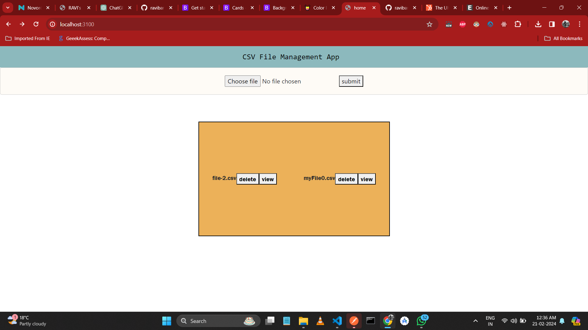
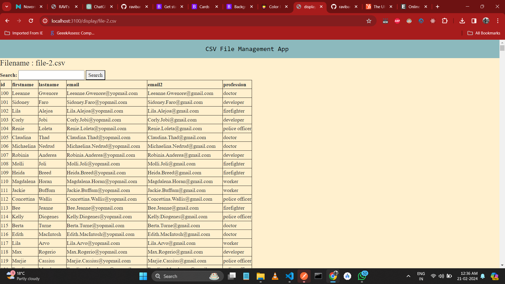

live url :- "https://csv-upload-node.onrender.com/"

project title : "csv-upload-file app"

project description : This is a csv-upload-file node app. That can upload csv file and perform certain operations.

features :-

1. adding new csv file
2. deleting a csv file
3. view a csv file in table form
4. search a data in that table

built using:-

1. node js
2. express js
3. ejs template engine
4. css
5. bootstrap
6. html 

deployment platform :-

1. [Render]

## Tech

Dillinger uses a number of open source projects to work properly:

1. [node-js]
2. [express-js]
3. [ejs-template-engine]
4. [css]
5. [bootstrap]
6. [html] 

## Plugins

Instructions on how to use them in your own application are linked below.

| Plugin | README |
| ------ | ------ |
| GitHub | [plugins/github/README.md]

[//]: # (These are reference links used in the body of this note and get stripped out when the markdown processor does its job. There is no need to format nicely because it shouldn't be seen. Thanks SO - http://stackoverflow.com/questions/4823468/store-comments-in-markdown-syntax)

[HTML]:<https://developer.mozilla.org/en-US/docs/Web/HTML>
[CSS]:<https://developer.mozilla.org/en-US/docs/Learn/CSS>
[node-js]:<https://nodejs.org/en>
[express-js]:<https://expressjs.com/>
[ejs-template-engine]: <https://ejs.co/>
[bootstrap]: <https://getbootstrap.com/>
[Render]:<https://dashboard.render.com/>

## Screenshots
   
- Home page
   

- File View

